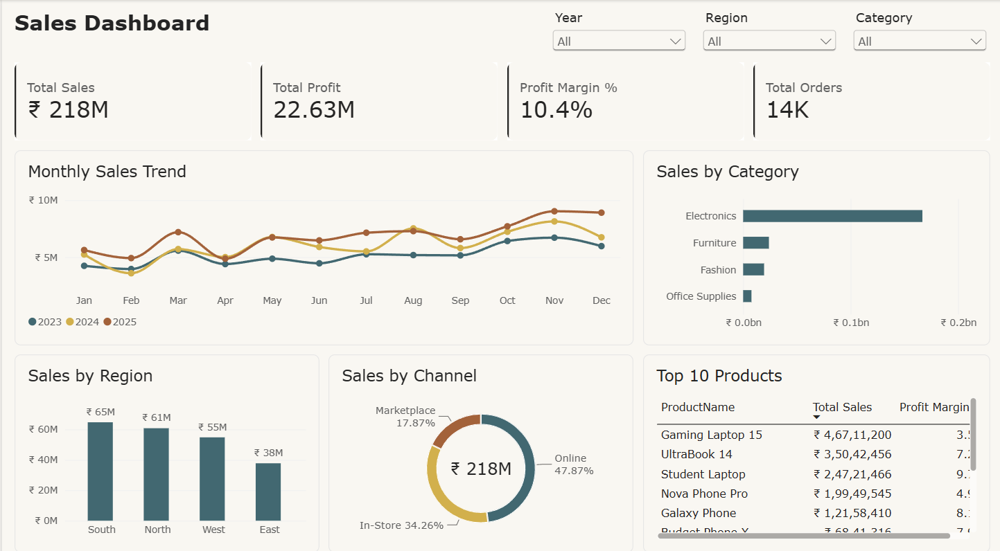

# Sales Dashboard: Power BI

A one-page Power BI dashboard analysing **3 years (2023–2025) of retail sales across India**. The data covers about 23.7K order lines, 14K orders, 1,200 customers, 42 products, 4 regions and 15 cities.



## Business questions answered
1. How much did we sell and earn, and at what margin?
2. How do sales move month by month, and how does each year compare?
3. Which product categories and regions bring in the most revenue?
4. Which sales channels do customers use?
5. Which products sell the most, and are they profitable?

## Key insights
- **₹21.8 Cr in sales and ₹2.26 Cr in profit** over three years, a **10.4% profit margin** across **14,169 orders**.
- **Sales grew every year:** ₹6.23 Cr in 2023, ₹7.32 Cr in 2024 (+17.6%) and ₹8.25 Cr in 2025 (+12.7%).
- **October–November is the peak season** in every year, driven by festive-season demand.
- **Electronics is about 77% of revenue but earns only ~6% margin.** Fashion (~33%) and Office Supplies (~26%) are far more profitable per rupee.
- **The best-selling products earn the lowest margins.** Gaming Laptop 15 is the #1 product (₹4.67 Cr) at just 3.5% margin.
- **South is the largest region** (₹6.47 Cr), followed by North, West and East.
- **Online is the main channel** (~48% of sales), then In-Store (~34%) and Marketplace (~18%).

## Dashboard contents
| Area | Visual |
|---|---|
| Filters | Slicers for **Year**, **Region** and **Category** |
| KPI cards | Total Sales · Total Profit · Profit Margin % · Total Orders |
| Trend | Line chart of monthly sales, one line per year |
| Breakdown | Bar chart by category · Column chart by region · Donut by channel |
| Detail | Top 10 products by sales, with profit margin |

Every visual is interactive. Clicking a region, category or channel filters the whole page.

## Skills demonstrated
- **Data modelling:** star schema with one fact table and four dimension tables
- **DAX:** calculated date table, calculated column and KPI measures
- **Power BI:** slicers, KPI cards, Top N filtering, cross-filtering and report layout

##  Files
```
├── Sales_dashboard.pbix   # the Power BI report
├── Screenshot.png         # dashboard screenshot
├── measures.dax           # DAX measures + calculated column
├── data/                  # dataset (CSV)
│   ├── fact_sales.csv     # one row per order line
│   ├── dim_product.csv
│   ├── dim_customer.csv
│   ├── dim_region.csv
│   └── sales_targets.csv  # monthly target per region (loaded for future analysis)
└── README.md
```

---

## Data model

```
                 dim_date
                    │ 1
                    ▼ *
dim_product ─1──*─ fact_sales ─*──1─ dim_customer
                    │ *
                    ▼ 1
                dim_region
```

| From (many) | To (one) | Cardinality | Filter direction |
|---|---|---|---|
| fact_sales[OrderDate] | dim_date[Date] | Many-to-one | Single |
| fact_sales[ProductID] | dim_product[ProductID] | Many-to-one | Single |
| fact_sales[CustomerID] | dim_customer[CustomerID] | Many-to-one | Single |
| fact_sales[RegionID] | dim_region[RegionID] | Many-to-one | Single |
| sales_targets[MonthStart] | dim_date[Date] | Many-to-one | Single |
| sales_targets[Region] | dim_region[Region] | Many-to-many | dim_region filters sales_targets |

## DAX

**Date table:** a calendar with one row per day from 2023 to 2025. It's marked as the model's date table, and Month is sorted by Month No.
```DAX
dim_date =
VAR MinYear = YEAR ( MIN ( fact_sales[OrderDate] ) )
VAR MaxYear = YEAR ( MAX ( fact_sales[OrderDate] ) )
RETURN
ADDCOLUMNS (
    CALENDAR ( DATE ( MinYear, 1, 1 ), DATE ( MaxYear, 12, 31 ) ),
    "Year",          YEAR ( [Date] ),
    "Quarter",       "Q" & QUARTER ( [Date] ),
    "Year Quarter",  YEAR ( [Date] ) & "-Q" & QUARTER ( [Date] ),
    "Month No",      MONTH ( [Date] ),
    "Month",         FORMAT ( [Date], "MMM" ),
    "Year Month",    FORMAT ( [Date], "MMM yyyy" ),
    "YearMonthKey",  YEAR ( [Date] ) * 100 + MONTH ( [Date] ),
    "Weekday No",    WEEKDAY ( [Date], 2 ),
    "Weekday",       FORMAT ( [Date], "ddd" ),
    "Is Weekend",    IF ( WEEKDAY ( [Date], 2 ) >= 6, "Weekend", "Weekday" )
)
```

**Calculated column**
```DAX
ShipDays = DATEDIFF ( fact_sales[OrderDate], fact_sales[ShipDate], DAY )
```

**Measures**
```DAX
Total Sales     = SUM ( fact_sales[SalesAmount] )
Total Profit    = SUM ( fact_sales[Profit] )
Profit Margin % = DIVIDE ( [Total Profit], [Total Sales] )
Total Orders    = DISTINCTCOUNT ( fact_sales[OrderID] )
```

---

## Open the report
1. Install **Power BI Desktop** (free, Windows), then download or clone this repository.
2. Open `Sales_dashboard.pbix`. The data is saved inside the file, so the dashboard works straight away.
3. **To refresh the data:** go to **Home → Transform data → Data source settings**, choose **Change source** for each file, and point it to the CSVs in your local `data/` folder.

---


*The dataset is synthetic, generated with Python for learning and portfolio use. All names and figures are fictional.*
